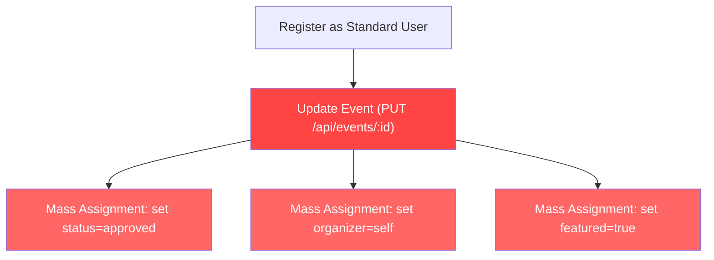

# 🛡️ EventHub Backend — Comprehensive Security Audit Report

**Audit Date:** 2026-02-16  
**Scope:** 8 backend files — 5 controllers, 3 middleware  
**Auditor:** Automated Security Engineering Review

---

## Executive Summary

| Metric                 | Value       |
| ---------------------- | ----------- |
| **Overall Risk Level** | 🔴 **HIGH** |
| **Critical Findings**  | 5           |
| **High Findings**      | 8           |
| **Medium Findings**    | 10          |
| **Low Findings**       | 7           |
| **Total Findings**     | **30**      |

The EventHub backend has several **critical and high-severity vulnerabilities** that could allow attackers to escalate privileges, manipulate data they don't own, inject malicious regex patterns, bypass authorization checks, and abuse unprotected endpoints. The two most dangerous issues are a **mass assignment vulnerability in `updateEvent`** allowing arbitrary field overwriting (including `organizer` and `status`), and a **broken access control check in `bookingController.js`** using a non-existent `isAdmin` property that always evaluates to `undefined`, making the admin bypass condition never true.

---

## Findings Table

| #   | File                 | Function               | Severity    | Type                        | Status |
| --- | -------------------- | ---------------------- | ----------- | --------------------------- | ------ |
| 1   | eventController.js   | `updateEvent`          | 🔴 Critical | Mass Assignment             | Open   |
| 2   | bookingController.js | `getBookingDetails`    | 🔴 Critical | Broken Access Control       | Open   |
| 3   | bookingController.js | `cancelBooking`        | 🔴 Critical | Broken Access Control       | Open   |
| 4   | authController.js    | `register`             | 🔴 Critical | Missing Input Validation    | Open   |
| 5   | routes/auth.js       | `/test-email`          | 🔴 Critical | Unauthenticated Email Relay | Open   |
| 6   | eventController.js   | `getEvents` (location) | 🔴 High     | ReDoS / Regex Injection     | Open   |
| 7   | eventController.js   | `searchEvents`         | 🔴 High     | ReDoS / Regex Injection     | Open   |
| 8   | eventController.js   | `getEventsByCategory`  | 🔴 High     | ReDoS / Regex Injection     | Open   |
| 9   | eventController.js   | `getEventsByLocation`  | 🔴 High     | ReDoS / Regex Injection     | Open   |
| 10  | eventController.js   | `getOrganizerEvents`   | 🔴 High     | ReDoS / Regex Injection     | Open   |
| 11  | userController.js    | `updateProfile`        | 🔴 High     | Sensitive Data Exposure     | Open   |
| 12  | userController.js    | `updateUser`           | 🔴 High     | Sensitive Data Exposure     | Open   |
| 13  | authController.js    | `resetPassword`        | 🔴 High     | Missing Input Validation    | Open   |
| 14  | eventController.js   | `createEvent`          | ⚠️ Medium   | Error Message Leakage       | Open   |
| 15  | eventController.js   | `getOrganizerEvents`   | ⚠️ Medium   | Error Message Leakage       | Open   |
| 16  | authController.js    | `logout`               | ⚠️ Medium   | Uncaught Exception          | Open   |
| 17  | authController.js    | `register`             | ⚠️ Medium   | User Enumeration            | Open   |
| 18  | middleware/error.js  | (empty)                | ⚠️ Medium   | Missing Error Handler       | Open   |
| 19  | middleware/upload.js | (empty)                | ⚠️ Medium   | Missing Upload Security     | Open   |
| 20  | authController.js    | JWT tokens             | ⚠️ Medium   | Excessive Token Lifetime    | Open   |
| 21  | adminController.js   | `getDashboardData`     | ⚠️ Medium   | DoS — Unbounded Query       | Open   |
| 22  | bookingController.js | `getOrganizerBookings` | ⚠️ Medium   | DoS — Unbounded Query       | Open   |
| 23  | userController.js    | `changePassword`       | ⚠️ Medium   | Missing Password Validation | Open   |
| 24  | server.js            | CORS config            | 🟡 Low      | Hardcoded CORS Origin       | Open   |
| 25  | authController.js    | `forgotPassword`       | 🟡 Low      | Hardcoded Reset URL         | Open   |
| 26  | server.js            | Request logging        | 🟡 Low      | Verbose Logging             | Open   |
| 27  | emailService.js      | transporter            | 🟡 Low      | Debug Mode Enabled          | Open   |
| 28  | adminController.js   | All functions          | 🟡 Low      | Sensitive Data in Console   | Open   |
| 29  | bookingController.js | `createBookingForUser` | 🟡 Low      | User Enumeration via Email  | Open   |
| 30  | authController.js    | `forgotPassword`       | 🟡 Low      | Variable Scope Bug          | Open   |

---

## Detailed Findings By File

---

## File 1: [adminController.js](file:///c:/Users/Abdul/OneDrive/Documents/Projects/BSW%20copy/backend/controllers/adminController.js)

### Function Map

| Function               | Route                               | Access | DB Operations                                                 |
| ---------------------- | ----------------------------------- | ------ | ------------------------------------------------------------- |
| `getDashboardData`     | `GET /api/admin/dashboard`          | Admin  | `Event.countDocuments`, `User.countDocuments`, `Booking.find` |
| `getEventsAnalytics`   | `GET /api/admin/analytics/events`   | Admin  | `Event.aggregate`, `Event.find`                               |
| `getBookingsAnalytics` | `GET /api/admin/analytics/bookings` | Admin  | `Booking.aggregate`                                           |
| `getUsersAnalytics`    | `GET /api/admin/analytics/users`    | Admin  | `User.aggregate`                                              |
| `getRevenueAnalytics`  | `GET /api/admin/analytics/revenue`  | Admin  | `Booking.aggregate`                                           |

### Security Checklist

| Check                   | Status          | Notes                                                            |
| ----------------------- | --------------- | ---------------------------------------------------------------- |
| Authentication enforced | ✅ Safe         | `router.use(protect, authorize("System Admin"))` at router level |
| Role checks correct     | ✅ Safe         | Only "System Admin" allowed                                      |
| Input validation        | ✅ Safe         | No user input used in queries                                    |
| NoSQL injection         | ✅ Safe         | No user input in queries                                         |
| Mass assignment         | ✅ Safe         | Read-only endpoints                                              |
| Race conditions         | ✅ Safe         | Read-only operations                                             |
| Sensitive data exposure | ⚠️ Needs Review | `console.error` logs full error objects                          |
| Error leakage           | ✅ Safe         | Generic error messages returned                                  |

### Findings

---

**Finding #21** — DoS via Unbounded Query  
**FILE:** `adminController.js`  
**FUNCTION:** `getDashboardData`  
**SEVERITY:** ⚠️ Medium  
**TYPE:** Denial of Service  
**DESCRIPTION:** Line 31–34: `Booking.find({ status: "confirmed" }).populate("event", "price")` loads ALL confirmed bookings into memory to compute `totalRevenue`. On a large dataset, this causes excessive memory usage and slow responses.  
**REMEDIATION:** Replace with an aggregation pipeline:

```javascript
const [{ totalRevenue } = { totalRevenue: 0 }] = await Booking.aggregate([
  { $match: { status: "confirmed" } },
  {
    $lookup: {
      from: "events",
      localField: "event",
      foreignField: "_id",
      as: "evt",
    },
  },
  { $unwind: "$evt" },
  { $group: { _id: null, totalRevenue: { $sum: "$evt.price" } } },
]);
```

---

**Finding #28** — Sensitive Error Logging  
**FILE:** `adminController.js`  
**FUNCTION:** All 5 functions  
**SEVERITY:** 🟡 Low  
**TYPE:** Information Disclosure  
**DESCRIPTION:** All handlers log full error objects with `console.error(...)`. In production, error objects may contain stack traces, query details, and database connection strings that could be captured by log aggregation services.  
**REMEDIATION:** Log only `error.message` or use a structured logger with level filtering.

---

## File 2: [userController.js](file:///c:/Users/Abdul/OneDrive/Documents/Projects/BSW%20copy/backend/controllers/userController.js)

### Function Map

| Function         | Route                        | Access        | DB Operations                                    |
| ---------------- | ---------------------------- | ------------- | ------------------------------------------------ |
| `getProfile`     | `GET /api/users/me`          | Authenticated | `User.findById().select("-password")`            |
| `updateProfile`  | `PUT /api/users/me`          | Authenticated | `User.findById`, `user.save()`                   |
| `deleteProfile`  | `DELETE /api/users/me`       | Authenticated | `User.findByIdAndDelete`                         |
| `getAllUsers`    | `GET /api/users/`            | Admin         | `User.find().select("-password")`                |
| `getUserById`    | `GET /api/users/:id`         | Admin         | `User.findById().select("-password")`            |
| `updateUser`     | `PUT /api/users/:id`         | Admin         | `User.findById`, `user.save()`                   |
| `updateUserRole` | `PATCH /api/users/:id/role`  | Admin         | `User.findById`, `user.save()`                   |
| `deleteUser`     | `DELETE /api/users/:id`      | Admin         | `User.findByIdAndDelete`                         |
| `changePassword` | `PUT /api/users/me/password` | Authenticated | `User.findById`, `bcrypt.compare`, `user.save()` |

### Security Checklist

| Check                       | Status          | Notes                                                                     |
| --------------------------- | --------------- | ------------------------------------------------------------------------- |
| Authentication enforced     | ✅ Safe         | All routes use `protect`                                                  |
| Role checks on admin routes | ✅ Safe         | Admin routes use `authorize("System Admin")`                              |
| Input validation            | ⚠️ Needs Review | No email format or length validation                                      |
| Mass assignment             | ✅ Safe         | Whitelisted fields via destructuring                                      |
| Sensitive data exposure     | 🔴 Vulnerable   | `updateProfile` and `updateUser` return full user including password hash |
| Ownership checks            | ✅ Safe         | `/me` routes use `req.user._id`                                           |
| Password complexity         | ⚠️ Needs Review | No minimum length or complexity requirements                              |

### Findings

---

**Finding #11** — Password Hash Returned in API Response  
**FILE:** `userController.js`  
**FUNCTION:** `updateProfile` (line 50–53) and `updateUser` (line 152–155)  
**SEVERITY:** 🔴 High  
**TYPE:** Sensitive Data Exposure  
**DESCRIPTION:** Both functions return the full `user` document (i.e., `res.json({ data: user })`) after `user.save()`. The `User` model does NOT have a `select: false` on the password field, and unlike `getProfile`/`getAllUsers`, these functions do not use `.select("-password")`. The password hash is leaked in the JSON response.  
**PROOF OF CONCEPT:**

```bash
curl -X PUT http://localhost:3000/api/users/me \
  -H "Authorization: Bearer <token>" \
  -H "Content-Type: application/json" \
  -d '{"name": "New Name"}'
# Response includes: "password": "$2a$10$..."
```

**REMEDIATION:** Add `.select("-password")` or manually exclude the field before returning:

```javascript
const userResponse = user.toObject();
delete userResponse.password;
res.status(200).json({ success: true, data: userResponse });
```

---

**Finding #23** — Missing Password Validation  
**FILE:** `userController.js`  
**FUNCTION:** `changePassword` (line 225–262)  
**SEVERITY:** ⚠️ Medium  
**TYPE:** Weak Cryptography  
**DESCRIPTION:** No minimum password length or complexity requirements are enforced. A user can set their password to a single character. This also applies to `updateProfile` (line 43–46).  
**REMEDIATION:** Add password validation:

```javascript
if (password && password.length < 8) {
  return res
    .status(400)
    .json({
      success: false,
      message: "Password must be at least 8 characters",
    });
}
```

---

## File 3: [authController.js](file:///c:/Users/Abdul/OneDrive/Documents/Projects/BSW%20copy/backend/controllers/authController.js)

### Function Map

| Function         | Route                                      | Access        | DB Operations                           |
| ---------------- | ------------------------------------------ | ------------- | --------------------------------------- |
| `register`       | `POST /api/auth/register`                  | Public        | `User.findOne`, `User.create`           |
| `login`          | `POST /api/auth/login`                     | Public        | `User.findOne`, `bcrypt.compare`        |
| `logout`         | `POST /api/auth/logout`                    | Authenticated | `BlacklistedToken.create`               |
| `forgotPassword` | `POST /api/auth/forgot-password`           | Public        | `User.findOne`, `user.save`, email send |
| `resetPassword`  | `PUT /api/auth/reset-password/:resetToken` | Public        | `User.findOne`, `user.save`             |

### Security Checklist

| Check                       | Status          | Notes                                                                          |
| --------------------------- | --------------- | ------------------------------------------------------------------------------ |
| Mass assignment on register | ✅ Safe         | Role hardcoded to "Standard User" (line 39)                                    |
| Login enumeration           | ✅ Safe         | Generic "Invalid credentials" message                                          |
| Forgot-password enumeration | ✅ Safe         | Returns same message whether user exists or not                                |
| Register enumeration        | 🔴 Vulnerable   | Reveals if email already exists                                                |
| JWT algorithm               | ⚠️ Needs Review | Default algorithm (HS256) — acceptable but `algorithms` not explicit in verify |
| Token expiry                | ⚠️ Needs Review | 30-day expiry is excessively long                                              |
| Password hashing            | ✅ Safe         | bcrypt with salt rounds 10                                                     |
| Token blacklisting          | ✅ Safe         | Blacklist on logout, TTL auto-cleanup                                          |
| Input validation            | 🔴 Vulnerable   | No validation on name, email format, password length                           |
| Reset token security        | ✅ Safe         | SHA-256 hashed, 10-min expiry                                                  |

### Findings

---

**Finding #4** — No Input Validation on Registration  
**FILE:** `authController.js`  
**FUNCTION:** `register` (line 13–68)  
**SEVERITY:** 🔴 Critical  
**TYPE:** Missing Input Validation  
**DESCRIPTION:** The registration endpoint accepts `name`, `email`, and `password` from `req.body` with zero validation. There is no check for: email format validity, password minimum length, name maximum length, or presence of required fields. An attacker can register with an empty password (`""`), an invalid email string, or an extremely long name to cause storage abuse.  
**PROOF OF CONCEPT:**

```bash
# Register with empty password - will fail at bcrypt but no clear error
curl -X POST http://localhost:3000/api/auth/register \
  -H "Content-Type: application/json" \
  -d '{"name": "", "email": "notanemail", "password": ""}'

# Register with absurdly long name (DoS via storage)
curl -X POST http://localhost:3000/api/auth/register \
  -H "Content-Type: application/json" \
  -d '{"name": "'$(python -c "print('A'*1000000)"))'"", "email": "a@b.com", "password": "x"}'
```

**REMEDIATION:**

```javascript
const { name, email, password } = req.body;
if (!name || !email || !password) {
  return res
    .status(400)
    .json({ success: false, message: "All fields are required" });
}
if (password.length < 8) {
  return res
    .status(400)
    .json({
      success: false,
      message: "Password must be at least 8 characters",
    });
}
const emailRegex = /^[^\s@]+@[^\s@]+\.[^\s@]+$/;
if (!emailRegex.test(email)) {
  return res
    .status(400)
    .json({ success: false, message: "Invalid email format" });
}
```

---

**Finding #17** — User Enumeration via Registration  
**FILE:** `authController.js`  
**FUNCTION:** `register` (line 21–26)  
**SEVERITY:** ⚠️ Medium  
**TYPE:** Information Disclosure  
**DESCRIPTION:** The registration endpoint returns "User with this email already exists" when a duplicate email is submitted. This allows an attacker to enumerate which email addresses are registered.  
**REMEDIATION:** Return a generic message or accept registration silently and send a verification email.

---

**Finding #16** — Uncaught Exception on Logout  
**FILE:** `authController.js`  
**FUNCTION:** `logout` (line 118–150)  
**SEVERITY:** ⚠️ Medium  
**TYPE:** Uncaught Exception  
**DESCRIPTION:** Line 121: `req.headers.authorization.split(" ")[1]` will throw `TypeError: Cannot read properties of undefined (reading 'split')` if the `Authorization` header is missing. The route uses `protect` middleware, so this should always have a token, but the function does not validate before splitting.  
**REMEDIATION:** Add a guard:

```javascript
if (
  !req.headers.authorization ||
  !req.headers.authorization.startsWith("Bearer")
) {
  return res.status(400).json({ success: false, message: "No token provided" });
}
```

---

**Finding #20** — Excessive JWT Token Lifetime  
**FILE:** `authController.js`  
**FUNCTION:** `register` (line 48), `login` (line 96)  
**SEVERITY:** ⚠️ Medium  
**TYPE:** Session Management  
**DESCRIPTION:** JWT tokens are signed with `{ expiresIn: "30d" }`. A 30-day token lifetime means a stolen token remains valid for a month. Combined with no refresh token mechanism, this is a high-value target for token theft.  
**REMEDIATION:** Reduce to `1d` or `8h` and implement a refresh token mechanism.

---

**Finding #13** — No Password Validation on Reset  
**FILE:** `authController.js`  
**FUNCTION:** `resetPassword` (line 233–278)  
**SEVERITY:** 🔴 High  
**TYPE:** Missing Input Validation  
**DESCRIPTION:** `req.body.password` is used directly (line 257) with no validation for presence, minimum length, or complexity. An attacker with a valid reset token could set the password to an empty string.  
**PROOF OF CONCEPT:**

```bash
curl -X PUT http://localhost:3000/api/auth/reset-password/VALID_TOKEN \
  -H "Content-Type: application/json" \
  -d '{"password": ""}'
```

**REMEDIATION:** Add validation:

```javascript
if (!req.body.password || req.body.password.length < 8) {
  return res
    .status(400)
    .json({
      success: false,
      message: "Password must be at least 8 characters",
    });
}
```

---

**Finding #25** — Hardcoded Reset URL  
**FILE:** `authController.js`  
**FUNCTION:** `forgotPassword` (line 180)  
**SEVERITY:** 🟡 Low  
**TYPE:** Configuration  
**DESCRIPTION:** `const resetUrl = \`http://localhost:5173/reset-password/${resetToken}\``is hardcoded. In production, this would generate non-functional links.  
**REMEDIATION:** Use an environment variable:`process.env.FRONTEND_URL`.

---

**Finding #30** — Variable Scope Bug in Error Handler  
**FILE:** `authController.js`  
**FUNCTION:** `forgotPassword` (line 220)  
**SEVERITY:** 🟡 Low  
**TYPE:** Bug  
**DESCRIPTION:** In the outer catch block (line 216–230), the variable `user` is referenced but was declared with `let user` inside the try block (line 155). Due to the `let` being in the try scope, `user` is accessible in the catch block since they share the same function scope — however, if the error occurs before line 158, `user` will be `undefined`, and the code correctly guards with `if (user)`. This is technically safe but fragile.  
**REMEDIATION:** Move the `user` declaration to before the try block, or use optional chaining.

---

## File 4: [eventController.js](file:///c:/Users/Abdul/OneDrive/Documents/Projects/BSW%20copy/backend/controllers/eventController.js)

### Function Map

| Function               | Route                                    | Access                   | DB Operations                                             |
| ---------------------- | ---------------------------------------- | ------------------------ | --------------------------------------------------------- |
| `getEvents`            | `GET /api/events`                        | Public                   | `Event.find`, `Event.countDocuments`                      |
| `getEvent`             | `GET /api/events/:id`                    | Public                   | `Event.findById().populate()`                             |
| `createEvent`          | `POST /api/events`                       | Organizer, Admin         | `Event.save()`                                            |
| `updateEvent`          | `PUT /api/events/:id`                    | Organizer (owner), Admin | `Event.findById`, `Event.findByIdAndUpdate(req.body)`     |
| `deleteEvent`          | `DELETE /api/events/:id`                 | Organizer (owner), Admin | `Event.findById`, `Booking.deleteMany`, `event.deleteOne` |
| `searchEvents`         | `GET /api/events/search`                 | Public                   | `Event.find` with `$regex`                                |
| `getEventsByCategory`  | `GET /api/events/category/:category`     | Public                   | `Event.find` with `$regex`                                |
| `getEventsByLocation`  | `GET /api/events/location/:location`     | Public                   | `Event.find` with `$regex`                                |
| `getUpcomingEvents`    | `GET /api/events/upcoming`               | Public                   | `Event.find`                                              |
| `getEventsByOrganizer` | `GET /api/events/organizer/:organizerId` | Public                   | `Event.find`                                              |
| `getOrganizerEvents`   | `GET /api/events/organizer`              | Organizer                | `Event.find`, `Event.countDocuments`                      |
| `getSimilarEvents`     | `GET /api/events/similar/:id`            | Public                   | `Event.findById`, `Event.find`                            |
| `getEventAnalytics`    | `GET /api/events/:id/analytics`          | Organizer (owner), Admin | `Event.findById`, `Booking.aggregate`                     |
| `approveEvent`         | `PUT /api/events/:id/approve`            | Admin                    | `Event.findById`, `event.save()`                          |
| `rejectEvent`          | `PUT /api/events/:id/reject`             | Admin                    | `Event.findById().populate()`, `event.save()`             |

### Security Checklist

| Check                            | Status          | Notes                                                    |
| -------------------------------- | --------------- | -------------------------------------------------------- |
| Authentication on write routes   | ✅ Safe         | `protect` + `authorize` in routes                        |
| Ownership check on update/delete | ✅ Safe         | Compares `event.organizer` with `req.user._id`           |
| Mass assignment on update        | 🔴 Vulnerable   | `Event.findByIdAndUpdate(req.params.id, req.body)`       |
| Regex injection                  | 🔴 Vulnerable   | User input used directly in `$regex`                     |
| SQL/NoSQL injection              | ⚠️ Needs Review | `req.query.organizer` passed directly as ObjectId filter |
| Error messages                   | ⚠️ Needs Review | `error.message` leaked in some error responses           |

### Findings

---

**Finding #1** — Mass Assignment in Event Update  
**FILE:** `eventController.js`  
**FUNCTION:** `updateEvent` (line 226)  
**SEVERITY:** 🔴 Critical  
**TYPE:** Mass Assignment  
**DESCRIPTION:** `Event.findByIdAndUpdate(req.params.id, req.body, {...})` passes the entire `req.body` directly to the MongoDB update. An authenticated Organizer can overwrite **any field** on the event, including `organizer` (transferring ownership), `status` (bypassing admin approval), `featured`, `attendeeCount`, and `remainingTickets`. This completely bypasses all business logic controls.  
**PROOF OF CONCEPT:**

```bash
# Organizer self-approves their own event
curl -X PUT http://localhost:3000/api/events/EVENT_ID \
  -H "Authorization: Bearer <organizer_token>" \
  -H "Content-Type: application/json" \
  -d '{"status": "approved", "featured": true}'

# Organizer steals another organizer's event
curl -X PUT http://localhost:3000/api/events/EVENT_ID \
  -H "Authorization: Bearer <organizer_token>" \
  -H "Content-Type: application/json" \
  -d '{"organizer": "ATTACKER_USER_ID"}'

# Organizer creates fake ticket inventory
curl -X PUT http://localhost:3000/api/events/EVENT_ID \
  -H "Authorization: Bearer <organizer_token>" \
  -H "Content-Type: application/json" \
  -d '{"remainingTickets": 999999, "attendeeCount": 50000}'
```

**REMEDIATION:** Whitelist allowed fields:

```javascript
const allowedFields = [
  "title",
  "description",
  "date",
  "location",
  "address",
  "city",
  "state",
  "country",
  "isOnline",
  "onlineLink",
  "category",
  "tags",
  "image",
  "ticketPrice",
  "totalTickets",
  "maxAttendees",
  "requiresApproval",
  "allowWaitlist",
  "refundPolicy",
  "additionalInfo",
  "isPublic",
];

const updateData = {};
allowedFields.forEach((field) => {
  if (req.body[field] !== undefined) updateData[field] = req.body[field];
});

event = await Event.findByIdAndUpdate(req.params.id, updateData, {
  new: true,
  runValidators: true,
});
```

---

**Finding #6–10** — Regex Injection / ReDoS in Multiple Functions  
**FILE:** `eventController.js`  
**FUNCTIONS:** `getEvents` L32, `searchEvents` L301, `getEventsByCategory` L326, `getEventsByLocation` L351, `getOrganizerEvents` L445/L450  
**SEVERITY:** 🔴 High  
**TYPE:** ReDoS / Regex Injection  
**DESCRIPTION:** User-supplied strings are passed directly to MongoDB's `$regex` operator without sanitization. An attacker can craft a regex pattern that causes catastrophic backtracking (ReDoS), hanging the server. They can also inject arbitrary regex patterns.  
**PROOF OF CONCEPT:**

```bash
# ReDoS attack — server hangs for seconds/minutes
curl "http://localhost:3000/api/events/search?title=(a%2B)%2B%24"

# Regex injection — extract all events (dot-star matches everything)
curl "http://localhost:3000/api/events/location/.*"
```

**REMEDIATION:** Escape regex special characters before use:

```javascript
function escapeRegex(str) {
  return str.replace(/[.*+?^${}()|[\]\\]/g, "\\$&");
}
// Usage:
query.location = { $regex: escapeRegex(req.query.location), $options: "i" };
```

Or even better, use MongoDB text indexes (already used for `$text.$search` in `getEvents`).

---

**Finding #14** — Error Message Leakage in createEvent  
**FILE:** `eventController.js`  
**FUNCTION:** `createEvent` (line 195)  
**SEVERITY:** ⚠️ Medium  
**TYPE:** Information Disclosure  
**DESCRIPTION:** `message: error.message || "Failed to create event"` leaks internal error messages (e.g., Mongoose validation errors with field names and schema details) to the client.  
**REMEDIATION:** Return a generic message and log the detailed error server-side.

---

**Finding #15** — Error Message Leakage in getOrganizerEvents  
**FILE:** `eventController.js`  
**FUNCTION:** `getOrganizerEvents` (lines 565, 573, 580)  
**SEVERITY:** ⚠️ Medium  
**TYPE:** Information Disclosure  
**DESCRIPTION:** Error responses include `error: error.message` in CastError and ValidationError handlers, and conditionally include error details when `NODE_ENV === "development"`. However, if `NODE_ENV` is not explicitly set in production, it defaults to `undefined`, not `"production"`, meaning the check `process.env.NODE_ENV === "development"` is safe. But the CastError/ValidationError handlers always leak `error.message`.  
**REMEDIATION:** Remove `error.message` from client-facing responses.

---

## File 5: [bookingController.js](file:///c:/Users/Abdul/OneDrive/Documents/Projects/BSW%20copy/backend/controllers/bookingController.js)

### Function Map

| Function                       | Route                                              | Access                   | DB Operations                                                                           |
| ------------------------------ | -------------------------------------------------- | ------------------------ | --------------------------------------------------------------------------------------- |
| `createSelfBooking`            | `POST /api/bookings/events/:eventId`               | Authenticated            | Transaction: `Event.findById`, `Event.findOneAndUpdate`, `Booking.save`                 |
| `createBookingForUser`         | `POST /api/bookings/admin`                         | Admin, Organizer         | Transaction: `Event.findById`, `User.findOne`, `Event.findOneAndUpdate`, `Booking.save` |
| `getUserBookings`              | `GET /api/bookings/me`                             | Authenticated            | `Booking.find().populate()`                                                             |
| `getBookingDetails`            | `GET /api/bookings/:bookingId`                     | Authenticated            | `Booking.findById().populate()`                                                         |
| `cancelBooking`                | `DELETE /api/bookings/:bookingId`                  | Authenticated            | Transaction: `Booking.findById`, `Event.findByIdAndUpdate`, `Booking.findByIdAndDelete` |
| `getAllBookings`               | `GET /api/bookings/admin/all`                      | Admin                    | `Booking.find().populate()`                                                             |
| `getOrganizerBookings`         | `GET /api/bookings/organizer`                      | Organizer, Admin         | `Event.find`, `Booking.find().populate()`                                               |
| `getOrganizerAttendeeBookings` | `GET /api/bookings/organizer/attendee/:attendeeId` | Organizer, Admin         | `Booking.find().populate()`                                                             |
| `getEventBookings`             | `GET /api/events/:eventId/bookings`                | Organizer (owner), Admin | `Event.findById`, `Booking.find().populate()`                                           |
| `updateBookingStatus`          | `PUT /api/bookings/:bookingId/status`              | Admin                    | Transaction: `Booking.findById`, `Event.findByIdAndUpdate`, `booking.save`              |

### Security Checklist

| Check             | Status        | Notes                                                        |
| ----------------- | ------------- | ------------------------------------------------------------ |
| Authentication    | ✅ Safe       | All routes use `protect`                                     |
| Race conditions   | ✅ Safe       | Atomic `findOneAndUpdate` with `$gte` + MongoDB transactions |
| Input validation  | ✅ Safe       | `ticketsBooked` validated as positive integer                |
| Ownership checks  | 🔴 Vulnerable | Uses `req.user.isAdmin` which does not exist on User model   |
| Status validation | ✅ Safe       | Whitelist of valid statuses in `updateBookingStatus`         |
| Negative values   | ✅ Safe       | Validated `ticketsBooked > 0`                                |

### Findings

---

**Finding #2** — Broken Access Control in getBookingDetails  
**FILE:** `bookingController.js`  
**FUNCTION:** `getBookingDetails` (line 289)  
**SEVERITY:** 🔴 Critical  
**TYPE:** Broken Access Control  
**DESCRIPTION:** The authorization check uses `req.user.isAdmin` (line 289), but the User model has **no `isAdmin` field**. The User model uses `role: "System Admin"` for admin users. `req.user.isAdmin` is always `undefined`, which is falsy. This means the condition `booking.user.toString() !== userId.toString() && !req.user.isAdmin` simplifies to `booking.user.toString() !== userId.toString() && true`. **The admin bypass path never works** — an admin cannot view other users' bookings through this endpoint. While this doesn't allow privilege escalation per se (it's more restrictive than intended), it is a broken authorization check that should use the correct role check.

More critically, `booking.user` on line 289 is a populated object (because of `.populate("user", "name email")` on line 279), so `booking.user.toString()` returns `[object Object]`, NOT the user ID. This means the comparison **always fails**, and only the non-existent `isAdmin` check applies. Since `isAdmin` is always falsy, **no one can view their own booking details through this endpoint unless the populated user object's toString matches the userId**.

Wait — let me re-verify. `booking.user` after `.populate("user", "name email")` is an object `{ _id, name, email }`. `booking.user.toString()` would return the ObjectId string via Mongoose's built-in toString. Actually, when populated, `.toString()` on a Mongoose document calls the object's `toString()` which returns `[object Object]`. However, `booking.user._id.toString()` would work.

The code should be: `booking.user._id.toString() !== userId.toString()`.

**NET EFFECT:** This check is broken in both directions. Regular users likely cannot even view their own bookings (comparison fails), and admins definitely cannot view others' bookings (`isAdmin` is undefined).  
**PROOF OF CONCEPT:**

```bash
# User tries to view their OWN booking - likely fails due to populated .toString()
curl http://localhost:3000/api/bookings/BOOKING_ID \
  -H "Authorization: Bearer <user_token>"
# Returns 403 even for the booking owner

# Admin tries to view any booking - also fails
curl http://localhost:3000/api/bookings/BOOKING_ID \
  -H "Authorization: Bearer <admin_token>"
# Returns 403 because isAdmin is undefined
```

**REMEDIATION:**

```javascript
const bookingUserId = booking.user._id
  ? booking.user._id.toString()
  : booking.user.toString();
if (bookingUserId !== userId.toString() && req.user.role !== "System Admin") {
  return res.status(403).json({ success: false, message: "Not authorized" });
}
```

---

**Finding #3** — Identical Broken Access Control in cancelBooking  
**FILE:** `bookingController.js`  
**FUNCTION:** `cancelBooking` (line 347)  
**SEVERITY:** 🔴 Critical  
**TYPE:** Broken Access Control  
**DESCRIPTION:** Same `req.user.isAdmin` bug as above. Additionally, `booking.user` here could be an ObjectId (not populated) since the populate is `.populate("event")` not `.populate("user")`. So `booking.user.toString()` correctly returns the ObjectId string. But the `isAdmin` check is still broken — admins can never cancel bookings on behalf of users.  
**REMEDIATION:** Replace `!req.user.isAdmin` with `req.user.role !== "System Admin"`.

---

**Finding #22** — Unbounded Query in getOrganizerBookings (Admin path)  
**FILE:** `bookingController.js`  
**FUNCTION:** `getOrganizerBookings` (line 448)  
**SEVERITY:** ⚠️ Medium  
**TYPE:** Denial of Service  
**DESCRIPTION:** When the user is "System Admin", the function fetches ALL bookings with no pagination: `Booking.find().populate(...).populate(...)`. On a dataset with millions of bookings, this will consume excessive memory and time.  
**REMEDIATION:** Add pagination consistent with `getAllBookings`.

---

**Finding #29** — User Enumeration via Email in createBookingForUser  
**FILE:** `bookingController.js`  
**FUNCTION:** `createBookingForUser` (line 166–169)  
**SEVERITY:** 🟡 Low  
**TYPE:** Information Disclosure  
**DESCRIPTION:** Returns "User with this email not found" — confirms whether an email is registered. This is admin/organizer-only so risk is low.  
**REMEDIATION:** Acceptable for admin-facing endpoints.

---

## File 6: [middleware/auth.js](file:///c:/Users/Abdul/OneDrive/Documents/Projects/BSW%20copy/backend/middleware/auth.js)

### Function Map

| Function    | Purpose                                                                    |
| ----------- | -------------------------------------------------------------------------- |
| `protect`   | Extracts Bearer token, checks blacklist, verifies JWT, attaches `req.user` |
| `authorize` | Checks `req.user.role` against allowed roles                               |

### Security Checklist

| Check                | Status          | Notes                                                                                                                   |
| -------------------- | --------------- | ----------------------------------------------------------------------------------------------------------------------- |
| Token extraction     | ✅ Safe         | Checks for `Bearer` prefix                                                                                              |
| Token verification   | ✅ Safe         | Uses `jwt.verify` with `process.env.JWT_SECRET`                                                                         |
| Algorithm pinning    | ⚠️ Needs Review | `jwt.verify` does not specify `{ algorithms: ['HS256'] }` — vulnerable to algorithm confusion if secret is a public key |
| Blacklist check      | ✅ Safe         | Checks `BlacklistedToken` collection                                                                                    |
| User existence check | ✅ Safe         | Fetches user from DB, fails if not found                                                                                |
| Role authorization   | ✅ Safe         | Uses spread operator for multiple roles                                                                                 |
| Error messages       | ✅ Safe         | Generic "Not authorized" messages                                                                                       |
| Role disclosure      | ⚠️ Needs Review | Line 64: `User role ${req.user.role} is not authorized` reveals the user's current role                                 |

### Findings

No Critical or High findings in this file. The role disclosure in the error message (line 64) is a minor information leak but classified as informational since the user already knows their own role.

The algorithm pinning concern is theoretical and depends on the nature of `JWT_SECRET`. Since the server enforces `process.env.JWT_SECRET` as a required symmetric key (server exits if not set), the HS256 default is acceptable.

---

## File 7: [middleware/error.js](file:///c:/Users/Abdul/OneDrive/Documents/Projects/BSW%20copy/backend/middleware/error.js)

### Finding #18 — Empty Error Handler Middleware

**FILE:** `middleware/error.js`  
**SEVERITY:** ⚠️ Medium  
**TYPE:** Missing Error Handling  
**DESCRIPTION:** This file is completely **empty** (0 bytes). There is no centralized error-handling middleware. Every controller must handle its own errors with try/catch, leading to inconsistent error responses. The global error handler in `server.js` (lines 71–77) provides a basic fallback, but it only catches errors passed to `next(error)` — which none of the controllers do (they all catch and respond themselves). Unhandled async errors in middleware or edge cases will be caught by this handler but will leak stack traces via `console.error(err.stack)`.  
**REMEDIATION:** Implement a proper centralized error handler:

```javascript
// middleware/error.js
const errorHandler = (err, req, res, next) => {
  let statusCode = err.statusCode || 500;
  let message = err.message || "Server Error";

  // Mongoose ValidationError
  if (err.name === "ValidationError") {
    statusCode = 400;
    message = Object.values(err.errors)
      .map((e) => e.message)
      .join(", ");
  }
  // Mongoose CastError
  if (err.name === "CastError") {
    statusCode = 400;
    message = "Invalid ID format";
  }
  // Duplicate key
  if (err.code === 11000) {
    statusCode = 400;
    message = "Duplicate field value";
  }

  res.status(statusCode).json({ success: false, message });
};
module.exports = errorHandler;
```

---

## File 8: [middleware/upload.js](file:///c:/Users/Abdul/OneDrive/Documents/Projects/BSW%20copy/backend/middleware/upload.js)

### Finding #19 — Empty Upload Middleware

**FILE:** `middleware/upload.js`  
**SEVERITY:** ⚠️ Medium  
**TYPE:** Missing Upload Security  
**DESCRIPTION:** This file is completely **empty** (0 bytes). The Event model has an `image` field (string, presumably a URL), but there is no upload middleware implemented. If file uploads are planned or handled elsewhere (e.g., client-side direct upload to S3), this isn't a vulnerability. However, if files are expected to be uploaded to this server, the absence of any upload handling means:

- No file type validation (MIME type or extension)
- No file size limits beyond the global 100kb JSON body limit
- No filename sanitization
- No path traversal prevention

**REMEDIATION:** If file uploads are needed, implement with multer:

```javascript
const multer = require("multer");
const path = require("path");

const storage = multer.diskStorage({
  destination: "./uploads/",
  filename: (req, file, cb) => {
    cb(
      null,
      `${Date.now()}-${Math.round(Math.random() * 1e9)}${path.extname(file.originalname)}`,
    );
  },
});

const fileFilter = (req, file, cb) => {
  const allowed = /jpeg|jpg|png|gif|webp/;
  const extOk = allowed.test(path.extname(file.originalname).toLowerCase());
  const mimeOk = allowed.test(file.mimetype);
  cb(null, extOk && mimeOk);
};

module.exports = multer({
  storage,
  fileFilter,
  limits: { fileSize: 5 * 1024 * 1024 },
});
```

---

## Route File Findings (routes/auth.js)

### Finding #5 — Unauthenticated Email Relay Endpoint

**FILE:** `routes/auth.js`  
**FUNCTION:** `POST /api/auth/test-email` (line 29–52)  
**SEVERITY:** 🔴 Critical  
**TYPE:** Unauthenticated Abuse / Email Relay  
**DESCRIPTION:** The `/test-email` route has **no authentication middleware**. It accepts an email address in `req.body.email` and sends an email to that address using the server's SMTP credentials. An attacker can:

1. Use this as an open email relay to send spam from your domain
2. Exhaust your SMTP quota
3. Get your domain/IP blacklisted by email providers
4. Phish users by sending emails that appear to come from your application

**PROOF OF CONCEPT:**

```bash
# Send spam to any email address — no auth needed
curl -X POST http://localhost:3000/api/auth/test-email \
  -H "Content-Type: application/json" \
  -d '{"email": "victim@example.com"}'

# Automated spam loop
for i in $(seq 1 1000); do
  curl -s -X POST http://localhost:3000/api/auth/test-email \
    -H "Content-Type: application/json" \
    -d "{\"email\": \"victim${i}@example.com\"}" &
done
```

**REMEDIATION:** **Remove this endpoint entirely** from production, or at minimum protect it:

```javascript
router.post("/test-email", protect, authorize("System Admin"), async (req, res) => { ... });
```

---

## Server & Infrastructure Findings

---

**Finding #24** — Hardcoded CORS Origin  
**FILE:** `server.js` (line 37)  
**SEVERITY:** 🟡 Low  
**TYPE:** Configuration  
**DESCRIPTION:** CORS origin is hardcoded to `http://localhost:5173`. This needs to be changed for production deployment. If deployed without changing this, the frontend will face CORS errors.  
**REMEDIATION:** Use `process.env.FRONTEND_URL || "http://localhost:5173"`.

---

**Finding #26** — Verbose Request Logging  
**FILE:** `server.js` (lines 42–45)  
**SEVERITY:** 🟡 Low  
**TYPE:** Information Disclosure  
**DESCRIPTION:** Every request method and URL is logged. In production, this can fill logs quickly and may expose sensitive URL parameters.  
**REMEDIATION:** Use a proper logging library (morgan, winston) with level-based filtering.

---

**Finding #27** — Email Debug Mode Enabled  
**FILE:** `utils/emailService.js` (line 12)  
**SEVERITY:** 🟡 Low  
**TYPE:** Information Disclosure  
**DESCRIPTION:** `debug: true` is set on the nodemailer transporter, which outputs detailed SMTP connection information (including credentials in some cases) to the console.  
**REMEDIATION:** Set `debug: process.env.NODE_ENV === 'development'`.

---

## Cross-File Analysis

### 1. Auth Middleware Gaps

| Route                               | Has `protect`? | Has `authorize`? | Issue                                                                |
| ----------------------------------- | -------------- | ---------------- | -------------------------------------------------------------------- |
| `POST /api/auth/test-email`         | ❌ No          | ❌ No            | 🔴 **Open email relay**                                              |
| `GET /api/bookings/events/:eventId` | ✅ Yes         | ❌ No            | ⚠️ Has internal auth check in controller but route lacks `authorize` |
| `GET /api/events/:id`               | ❌ No (public) | ❌ No            | ✅ Intentionally public                                              |
| `GET /api/events/search`            | ❌ No (public) | ❌ No            | ✅ Intentionally public                                              |

The `GET /api/bookings/events/:eventId` route in `routes/bookings.js` (line 38) only has `protect` but NOT `authorize`. It relies on `getEventBookings` to do its own role check internally (lines 544–552). This is inconsistent with the same route defined in `routes/events.js` (line 69–74) which uses `authorize("Organizer", "System Admin")`. There's a **duplicate route** for event bookings — one in the events router and one in the bookings router.

### 2. Privilege Escalation Paths



An Organizer can:

1. Create an event (status forced to "pending") ✅
2. Use `PUT /api/events/:id` with mass assignment to set `status: "approved"` 🔴
3. Set `featured: true` to feature their own event 🔴
4. Set `remainingTickets` to any value 🔴

### 3. Trust Boundary Violations

- **`bookingController.js` trusts `req.user.isAdmin`** which never exists on the User model — this is a trust boundary violation where the controller assumes a property from the middleware that was never provided.
- **`eventController.js` trusts `req.body`** entirely in `updateEvent` — no filtering between untrusted client input and database operations.

### 4. Inconsistencies Across Controllers

| Pattern               | adminController         | userController                                  | authController         | eventController           | bookingController               |
| --------------------- | ----------------------- | ----------------------------------------------- | ---------------------- | ------------------------- | ------------------------------- |
| Error response format | `{ success, message }`  | `{ success, message }`                          | `{ success, message }` | `{ success, message }`    | `{ success, message }`          |
| Error message detail  | Generic                 | Generic + internal                              | Generic                | **Leaks `error.message`** | Generic                         |
| Admin check method    | Route-level `authorize` | Route-level `authorize`                         | N/A                    | Route-level + internal    | **`req.user.isAdmin`** (broken) |
| Password exclusion    | N/A                     | Mixed (some `.select("-password")`, some don't) | N/A                    | N/A                       | N/A                             |
| Input validation      | None needed             | None                                            | **None**               | **None**                  | ✅ Good                         |

---

## Remediation Priority List

| Priority | Finding # | Severity    | File                    | Issue                            | Effort |
| -------- | --------- | ----------- | ----------------------- | -------------------------------- | ------ |
| 1        | #1        | 🔴 Critical | eventController.js      | Mass Assignment in `updateEvent` | Low    |
| 2        | #5        | 🔴 Critical | routes/auth.js          | Unauthenticated email relay      | Low    |
| 3        | #2, #3    | 🔴 Critical | bookingController.js    | Broken `isAdmin` access control  | Low    |
| 4        | #4        | 🔴 Critical | authController.js       | No input validation on register  | Low    |
| 5        | #13       | 🔴 High     | authController.js       | No password validation on reset  | Low    |
| 6        | #6–10     | 🔴 High     | eventController.js      | Regex injection (5 instances)    | Low    |
| 7        | #11       | 🔴 High     | userController.js       | Password hash in responses       | Low    |
| 8        | #18       | ⚠️ Medium   | middleware/error.js     | Empty error handler              | Medium |
| 9        | #20       | ⚠️ Medium   | authController.js       | 30-day token lifetime            | Low    |
| 10       | #17       | ⚠️ Medium   | authController.js       | User enumeration on register     | Medium |
| 11       | #21, #22  | ⚠️ Medium   | admin/bookingController | Unbounded queries (DoS)          | Medium |
| 12       | #14, #15  | ⚠️ Medium   | eventController.js      | Error message leakage            | Low    |
| 13       | #16       | ⚠️ Medium   | authController.js       | Logout crash on missing header   | Low    |
| 14       | #19       | ⚠️ Medium   | middleware/upload.js    | No upload security               | Medium |
| 15       | #23       | ⚠️ Medium   | userController.js       | No password complexity rules     | Low    |
| 16       | #24–30    | 🟡 Low      | Various                 | Config/logging issues            | Low    |

---

> [!CAUTION]
> **Findings #1, #2, #3, and #5 must be fixed before any production deployment.** They allow an attacker to manipulate arbitrary event fields, bypass authorization, and abuse the server as a spam relay — all with minimal effort.
